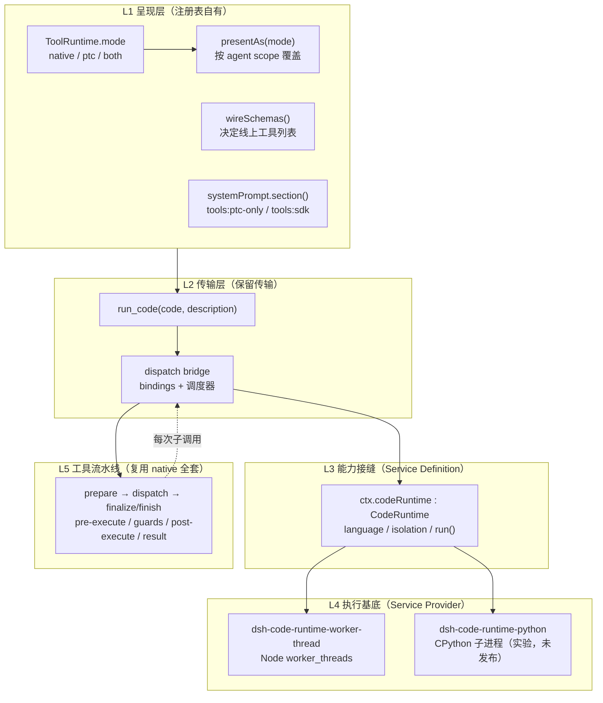
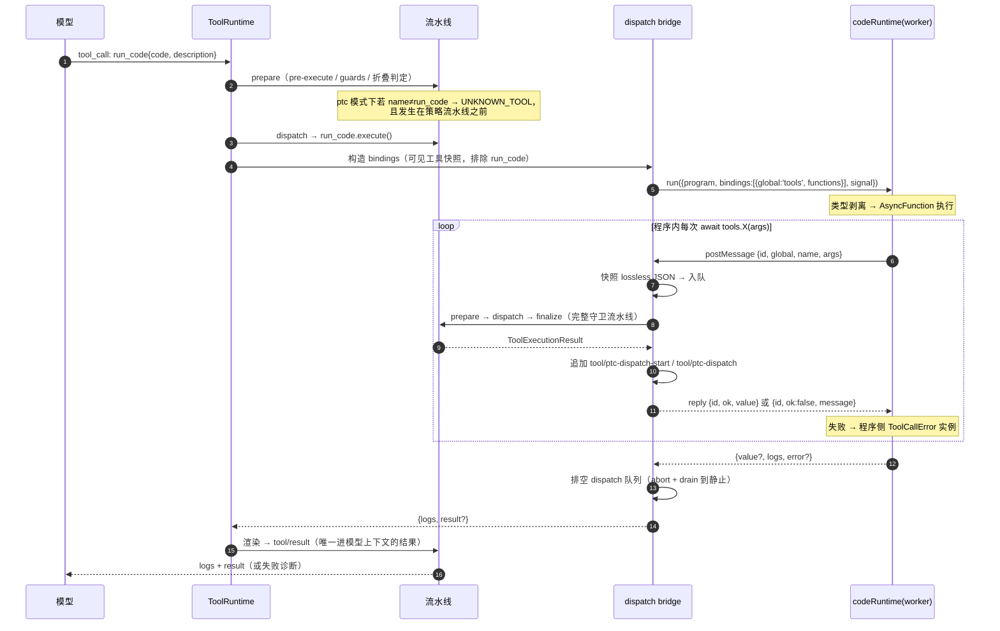
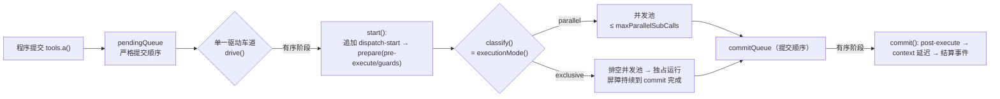

# DeepSeek Harness — PTC 模式技术架构参考

> **文档职责**：DSH 上游 PTC（Programmatic Tool Calling）模式的**架构事实与开发落点**。
> 面向需要改动/扩展 PTC 的开发者：讲清"模型写的程序如何变成工具调用、又怎样回到模型上下文"。
>
> **不在本文范围内**（各自有唯一归属，勿在此重复）：
> - 本 preset 自身的机制与踩坑 → [`pitfalls.md`](pitfalls.md)
> - PTC 对 **本仓库** 的版本迁移影响 → [`dsh-v0.1.6-ptc-impact.md`](dsh-v0.1.6-ptc-impact.md)
> - 外部生态（Anthropic / OpenAI / Cloudflare）对比研究 → [`2026-09-15-ptc-code-mode-research.md`](2026-09-15-ptc-code-mode-research.md)

## 0. 版本锚点与证据分级

**分析基线**：`@deepseek-ai/dsh-root` **0.1.5-rc.2**，commit `c291e7961a515f6d7af9304e7fd1d257929aef26`（2026-09-10），`git describe` = `dsh-v0.1.5-rc.2-139-gc291e7961a`。
根路径记为 `$DSH`（本次分析为 `/Users/eric/Project/tests/deepseek-harness`）。**所有 `file:line` 均指该 commit 的工作区。**

> ⚠️ PTC 仍在快速演进（本 checkout 是 `0.1.5-rc.2` 之后 139 个 commit）。引用结论前先确认版本；尤其**信任姿态与沙箱集成**已确知在后续版本发生变化（见 §9.3）。

| 标记 | 含义 |
|---|---|
| 【C】 | **代码验证** —— 已读源文件，附 `file:line`（最高可信） |
| 【D】 | 官方文档 / 生成目录（`docs/`、`tool-catalog.md`、`config-catalog.md`） |
| 【N】 | 官方设计笔记（`.agents/notes/`，实现态） |
| 【W】 | 外部资料（附 URL，含外部作者的分级） |
| 【?】 | 未验证 / 存疑 —— 已显式标注，勿当结论使用 |

---

## 1. 一句话架构

**PTC 是工具注册表的一种"呈现模式"，不是独立的执行器**：注册表把 N 个工具 schema 折叠成 **1 个保留传输 `run_code`** + 一段**生成的 SDK 声明**；模型改为写一段程序，程序里的 `await tools.<name>(args)` 由**桥接层**重新送进**同一条受守卫的工具流水线**，只有程序 `print`/`return` 的内容回到模型上下文。

```
native 模式：模型 ──tool_call(每步一个)──▶ 流水线 ──tool_result(全部)──▶ 模型上下文
                    └─ N 次往返，N 份中间结果进上下文

PTC  模式：模型 ──run_code(一个程序)──▶ 代码运行时（独立 worker，非安全边界见 §9）
                    │                      │  await tools.a() / tools.b()  ← 程序内部编排
                    │                      ▼
                    │              桥接层 → 同一条受守卫流水线（每次子调用都全流水线）
                    └─ tool_result(仅程序刻意输出的) ──▶ 模型上下文
                       └─ 子调用只写日志（tool/ptc-dispatch*），不进模型上下文
```

**核心设计意图**【N】：LLM 写代码比"emit tool call"更擅长（见过百万行真实代码，却少见人造的 tool-calling trace）——该论据直接引自 Cloudflare Code Mode。PTC 用**同一份可见工具集的两个投影**（native schema / 生成 SDK）换取"程序化组合能力 + 中间结果不进上下文"。

---

## 2. 术语

| 术语 | 含义 | 易混淆点 |
|---|---|---|
| **PTC** | Programmatic Tool Calling，本文主角 | 与 CAD 厂商 PTC Inc. / 生物制药 PTC Therapeutics 无任何关系【W】 |
| **native** | 默认模式：每个可见工具作为 JSON-Schema function definition 上线 | 不是"原生/非原生"的语义，只是一个模式的**取值名** |
| **PTC 模式 / PTC mode** | 面向用户的说法（zh 为「PTC 模式」）；标识符一律用 `ptc`（不带 `-mode`），因为**它不是 plan-mode 那样的兄弟模式**，而是一种承载传输【N】 | 旧名 **Code Mode**（2026-08-25 更名，见 §8.3） |
| **保留传输（reserved transport）** | `run_code` —— 它**不是**一个普通注册工具，而是注册表自有的呈现基础设施，位于可过滤能力层**之外** | 不能被 `restrict()` 移除、不能被注册/遮蔽 |
| **SDK section** | 系统提示词里 `tools:sdk` 段，按运行时语言生成的 `.d.ts` 风格声明 | 与 `tools:ptc-only`（规则段）是两段 |
| **子调用 / sub-dispatch** | 程序内部一次 `tools.X()` 触发的嵌套执行 | 带 `parent` token，与"模型直呼"相对 |
| **seam（接缝）** | 官方架构用语：Service Definition（接口）+ Service Provider（实现）+ Consumer 的三方解耦 | 见 `docs/capability-seams.md` |

---

## 3. 分层架构

PTC 的价值在于**职责被切得很干净**：注册表不懂代码执行，运行时不懂工具。



| 层 | 包 | 单一职责 | 证据 |
|---|---|---|---|
| L1 呈现 | `@deepseek-ai/dsh-tools` | 决定模型**看到什么**（schema 投影 + 提示词段 + 折叠执行面） | 【C】`packages/core/tools/src/index.ts` |
| L1' 选择 | `@deepseek-ai/dsh-agent-tool-presentation` | 把一个 **agent preset** 绑定到某个呈现模式 | 【C】`packages/core/agent-tool-presentation/src/index.ts`（72 行，只做一次 `presentAs`） |
| L2 传输+桥接 | `@deepseek-ai/dsh-tools`（`ptc.ts`） | `run_code` 定义、binding 构造、调度、结算、日志 | 【C】`packages/core/tools/src/ptc.ts`（678 行） |
| L3 接缝 | `@deepseek-ai/dsh-code-runtime` | 只依赖 `cordis`；**不知道 tools 存在** | 【C】`packages/code-runtime/code-runtime/src/{index,types}.ts`（137+131 行） |
| L4 基底 | `@deepseek-ai/dsh-code-runtime-worker-thread` | 一次运行一个新 worker；预算/终止/输出账本 | 【C】`packages/code-runtime/code-runtime-worker-thread/src/index.ts`（561 行） |
| L4' 基底 | `@deepseek-ai/dsh-code-runtime-python` | Python 语言后端（**experimental、private、未发布**） | 【C】`packages/code-runtime/code-runtime/src/index.ts:106-110` |

> **接缝的三方关系**【D】：Service Definition = `dsh-code-runtime`（`ctx.codeRuntime`）；Service Provider = worker-thread（及未来 container/process）；Consumer = `dsh-tools`。运行时收到的只是"一段程序 + 若干命名异步 binding"，返回 `{ value, logs, error? }`——**语言与执行基底都是后端属性**，因此换语言/换基底不需要重新设计（这是 PTC 能同时支持 TS 与 Python 的原因）。

---

## 4. 控制流：一次 `run_code` 的完整路径



### 4.1 阶段拆解【C】

1. **折叠判定（prepare，策略之前）** —— `createExecution` 用共享谓词 `collapses(name, scope, nested)`【C】`index.ts:1314-1316`（`!nested && mode==='ptc' && name!=='run_code'`）判定。被折叠的调用**在 `tools/pre-execute` 之前**就变成 `UNKNOWN_TOOL`，且 message **携带纠正路径**（"call \`X\` from inside a \`run_code\` program instead"）【C】`index.ts:1413-1433`；已 abort 的调用仍按取消契约返回 `ABORTED_BEFORE_DISPATCH`【C】`index.ts:1419-1421`。
2. **构造 bindings** —— 枚举 `registry.schemas(exec.agent)`（**调用 agent 的可见集**，与 SDK 段声明的完全同一视图，因此程序能绑到的恰好是 prompt 承诺的那些），跳过 `run_code` 自己【C】`ptc.ts:600-612`。命名空间对象用 **null-prototype + `defineProperty`** 构建：名为 `__proto__` 的工具必须成为**普通自有键**，否则普通对象赋值会命中原型 setter 而**静默丢失该 binding**【C】`ptc.ts:601-612`。
3. **运行程序** —— `ctx.codeRuntime.run({ program, bindings, signal })`，signal 是**运行作用域**的 controller：跟随外层 cancel，且**运行因任何原因结算时都会 abort**，从而不会遗留孤儿 dispatch【C】`ptc.ts:337-339`。
4. **子调用重入流水线** —— 通过私有 staged 接口 `registry[TOOL_RUNTIME_SCHEDULER]`（`prepare` / `dispatch` / `finalize` / `finish`）【C】`index.ts:444-453`、`index.ts:789-794`。
5. **结算与排空** —— 运行时结算后 `drainDispatches()`：abort 在飞调用、放弃未启动的排队项、排空有序 commit lane（**包括程序已 return 时正在进行的 commit**）【C】`ptc.ts:448-456`。**没有任何子调用能在 `run_code` 结算后追加。**

### 4.2 子调用的身份

| 字段 | 值 | 说明 |
|---|---|---|
| `callId` | `<parentCallId>:ptc:<n>` | `n` 按**提交顺序**自增【C】`ptc.ts:469` |
| `rootCallId` | 外层 root | 透传 |
| `parent` | `exec.token`（外层执行令牌） | **这是"嵌套"的唯一判别式**，也是绕过折叠的凭据【C】`ptc.ts:476` |
| `signal` | 运行作用域 controller | 非外层 signal |

> **不变量**【N】：`parent` token 是生产代码里唯一设置嵌套语义的地方；未来任何复合传输只要设置了 `parent`，其子调用就自动获得完整工具表——这与该 token 已文档化的语义一致。
>
> **id 对消费者不透明**【N】：历史 id（含 `:code:` 片段）在会话格式迁移中**逐字节保留**；消费者只能按精确相等关联，不得解析。

### 4.3 上下文延迟（`deferContext`）

子调用的 `additionalContexts` **不能在 `run_code` 内注入**（会破坏父子 call/result 邻接性）。桥接层用 `exec.deferContext()` 按**提交顺序**收集，并在外层结果之后、且**同一步骤的所有兄弟结果之后**追加【N】【C】`ptc.ts:561-582`：
- 成功且最终 content 含 image ⇒ 整段 content 以 `{ kind:'plugin', plugin:'tools-ptc' }` 归因延迟【C】`ptc.ts:561-566`；
- 外层 post-execute **阻塞**时丢弃工具延迟项，只保留阻塞决策显式附加的 context【N】。

---

## 5. 数据契约（可直接引用的类型）

### 5.1 代码执行接缝【C】`packages/code-runtime/code-runtime/src/types.ts`

```ts
type CodeJsonValue = null | boolean | number | string | CodeJsonValue[] | { [key: string]: CodeJsonValue }

interface CodeRunRequest {
  program: string                       // 语言由 runtime.language 决定
  bindings: CodeBindingNamespace[]
  signal?: AbortSignal
}

interface CodeBindingNamespace {
  global: string                        // 程序内的全局名（PTC 传 'tools'）
  functions: Record<string, CodeBindingFunction>
  errorClass?: { name: string; memberNameProperty: string }   // PTC 传 ToolCallError / toolName
}

type CodeBindingFunction = (args: unknown) => Promise<CodeJsonValue>

interface CodeRunResult {
  value?: CodeJsonValue                 // 顶层 return；undefined = 无完成值
  logs: string[]
  error?: CodeRunFailure
}

interface CodeRunFailure {
  kind: 'exception' | 'timeout' | 'abort' | 'worker-exit' | 'invalid-output' | 'output-limit'
  message: string
}
```

**契约要点**：
- **错误是 result 的字段，不是 `run()` 的 rejection**【C】`types.ts:110-114`。`run()` 只在**调用方/seam 误用**时 reject（例如重名 binding namespace）；后端不合规的 reject 由 Consumer 在自己的错误边界兜住。
- 失败 kind **正交**：超时不是异常、abort 不是超时、**有损完成**不是溢出、基底死亡都不是以上任何一类。
- `language` / `isolation` 是**只读的、信息性的描述符，不是安全断言**【C】`index.ts:102-119`（`isolation` 的已知取值 `'worker-thread' | 'process' | 'container'`）。

### 5.2 保留传输的输出【C】`ptc.ts:259`、`ptc.ts:312-325`

```ts
type RunCodeOutput = { logs: string[]; result?: JsonValue }
```

- **Native renderer**：logs 在前；`result` 若为 string 原样输出，其余 JSON 根用**迭代式** pretty printer（总缩进上限 10 字符，更深子树紧凑化，保证遍历栈安全 + 格式化尺寸线性）【C】`ptc.ts:168-256`。
- 两者皆空 ⇒ `(run_code completed with no output)`【C】`ptc.ts:324`。

### 5.3 `run_code` 的工具定义【C】`ptc.ts:293-320`

```ts
{
  name: 'run_code',
  parameters: { code: {type:'string', required:true}, description: {type:'string', required:true} },
  output: { schema: { type:'object', properties: { logs: string[], result: json } } },
}
```

- `description` 参数**必填**且非空，是 UI 上永远可见的标签（沿用 `bash` 的 `description` 先例）；**程序本体走 `rawInput`**【C】`ptc.ts:328-330`、`ptc.ts:649-654`。
- `description` 与 `code` 的文案由**语言 flavor 表**在 schema 发射时决定（TS / Python 各一套），保证模型看到的 schema 与 SDK 段语言一致【C】`ptc.ts:82-85`、`ptc.ts:112-129`。
- **刻意不声明 `presentResult`**：`run_code` 声明了 `presentCall`（`card:'generic'`, `kind:'execute'`, `title = description`, `rawInput = code`），但**它和 `presentResult` 在内置 Web 客户端都没有消费者**——真实卡片由客户端从 raw args/result/metadata 派生（见 §10.2）。⚠️ 这意味着**改 `presentCall` 不会改变 Web 端外观**【C】`ptc.ts:649-658`【D】`packages/core/tools/README.md:89`。

### 5.4 并发契约【C】`index.ts:261`、`index.ts:1266-1275`

```ts
interface ToolDefinition { /* … */ isConcurrencySafe?(args: unknown): boolean }

type ToolExecutionMode = { kind: 'parallel' } | { kind: 'exclusive' }

executionMode(exec): ToolExecutionMode
// 只有严格 === true 才是 parallel；未知/隐藏/未声明/参数非法/抛异常 ⇒ exclusive（fail-closed）
```

**同一个分类器同时服务 native 循环与 PTC 桥接**【N】——安全性声明归**工具**所有，不归调用方。

### 5.5 宿主 ↔ worker 线协议（写新后端必读）【C】

**没有握手**：启动即用 `workerData` 传 `WorkerBootData { code, namespaces[{global, names[], errorClass?}], maxOutputBytes }`——注意 **函数本身从不过界，只传名字**。

| 方向 | 帧 |
|---|---|
| worker → host | `call{id,global,name,args}` · `log{text}` · `output-limit{}` · `done{value? \| error?}` |
| host → worker | `reply{id, ok, value}` 或 `reply{id, ok:false, message}` |

两条对开发有实际约束的设计：

1. **载荷用扁平前序 token 数组编解码**（容器编码为 `{kind:'array',length}` / `{kind:'object',keys}`），使 structured clone **永远看不到应用的嵌套深度**——因此合法的深层 JSON 既不受 JS 调用栈深度限制，也不受平台特有的嵌套克隆上限限制。
2. **宿主逐字段重建每个入站帧**，并把端口协议当作**敌意对端**：未知名字、重复 id、结算后的消息一律拒绝或忽略（对端跑的是模型代码）。

**取消语义**：abort 是**硬中断（可在循环中途）**，但**在飞的 binding 调用由调用方负责结算**——运行时只是不再发问；Consumer 在 `ptc.ts:628-633` 履行这一点。

---

## 6. 调度器：有序车道 + 有界并行

这是 PTC 最容易被误读的部分：**`Promise.all` 不保证并行**。



**规则**【N】【C】`ptc.ts:341-446`：

1. **提交顺序即启动顺序**：队列严格 FIFO，分类在**启动前一刻**重读（排队期间注册表变化可把调用翻成 exclusive）。
2. **只有一个有序车道**：`start`（事件追加 + `prepare`）、`commit`（`post-execute` + context 延迟 + 结算事件）全部在**同一条 `drive()` 车道**内串行；**只有 around-dispatch/body 阶段并发**——与 native 循环的时序完全一致。
3. **容量判定**：`exclusive` 要求 `inFlight.size === 0`；`parallel` 要求 `inFlight.size < maxParallel`【C】`ptc.ts:419-420`。
4. **exclusive 的屏障覆盖 post-execute**：屏障直到该调用的 commit 完成才释放【C】`ptc.ts:405-407`。
5. **结算即放弃**：运行结算后，排队未启动的项以 binding rejection 结束，**且不产生任何事件**（`started ⇔ settles exactly once` 不变量因此无需第三个"abandoned"事件）【N】。
6. **背压**：`commit` 尾部 `while (logWork.size > maxParallel) await Promise.race(logWork)`——慢日志后端会**阻塞后续子调用的启动**，防止待写事件与内存无界增长【C】`ptc.ts:579-582`。

**配置**：`tools.maxParallelSubCalls`，默认 **10**（与 native 循环调度器默认值相同），`1` 恢复严格串行【D】`docs/config-catalog.md:3176-3184`。

> **为什么不能直接复用循环调度器**【N】：循环调度的是**一批已完全解析、且结果按模型顺序提交**的调用；桥接调度的是**开放式提交流、结果回到程序而非 transcript**。共享的是**契约**（分类 / 池 / 屏障），不是机器。

---

## 7. 提示词与线上形态

### 7.1 两个提示词段【C】

| 段名 | 顺序 | 生效条件 | 内容 |
|---|---|---|---|
| `tools:ptc-only` | `PTC_ONLY = 800` | 仅 `ptc`（`both` 渲染为空串） | 一句话规则：只有 `run_code` 可直呼，其他工具从程序内部到达 |
| `tools:sdk` | `TOOLS_SDK = 5000` | `ptc` / `both`（`native` 渲染为空串） | 该作用域可见工具的生成式 SDK |

顺序带【C】`packages/core/system-prompt/src/index.ts:121-154`：规则段（800）**早于**所有首方按工具引导段（`TOOL_BASH=1000` … `TOOL_SUBAGENT=2800`），SDK 段（5000）**晚于**它们。

> **为什么需要规则段**【N】：每个工具都贡献自己的引导段并点名自己，**却都不说明"怎么到达"**。模型若只读这些段，就会发出 native 调用，收到 `UNKNOWN_TOOL`——而那个工具**刚刚在同一个 prompt 里被声明过**——于是判定部署自相矛盾，而不是自我纠正。`both` 渲染为空是因为那里的 native 调用**确实会执行**，写这句话就是假的。

### 7.2 SDK 生成【C】`ts-types.ts:297-317`、`index.ts:53-56`

- 按**工具名字典序**排序（字节稳定，利于 provider 缓存）。
- 工具名以**带引号的对象键**出现（`tools["my-tool"](…)`），因此不需要别名/去重逻辑——这是官方明确拒绝 Cloudflare 式"标识符净化"方案的原因【N】。
- 由**同一组 schema** 派生参数与输出类型，输出类型来自工具的**canonical output schema**（不是 Native 渲染文本）。

生成体外形【C】（`snapshots/session/ptc-turn/system-prompt.expected.md`）：

```ts
type JsonValue = null | boolean | number | string | JsonValue[] | { [key: string]: JsonValue }

interface ToolArgsMap { /* 每个可见工具一条精确推断项（含 JSDoc 描述） */ }
interface ToolOutputMap { /* 每个可见工具一条精确输出类型 */ }
type ToolName = keyof ToolOutputMap

declare class ToolCallError extends Error {
  readonly name: "ToolCallError";
  readonly toolName: ToolName;
}
declare const tools: {
  [K in ToolName]: (args: ToolArgsMap[K]) => Promise<ToolOutputMap[K]>;
}
```

- **类型是咨询性的**：运行时在执行前 strip 掉类型【N】。
- 不支持的 schema 构造降级为 `unknown`，**不阻断装配**。
- 支持 **erasable TypeScript only**（无 `enum`/namespace）；非可擦除语法在**拉起 worker 之前**就以 `error.kind:'exception'` 返回。

### 7.3 线上工具列表：真的只剩一个【C】

`snapshots/session/ptc-turn/tool-schemas.expected.json` 的实际内容（`initial` 数组）**只有 `run_code` 一项**，`changes` 为空数组——这是"折叠"最硬的证据。

`wireSchemas()` 的分支【C】`index.ts:969-994`：
- `native` → 全部可见 schema；
- `ptc` → `schemas.filter(name === RUN_CODE_NAME)`，`knownNames = ['run_code']`；
- `both` → 全部 schema（`view.visible` 在非 native 作用域已把 `run_code` 追加进去），`knownNames` 再显式并入 `run_code`。

> **装配期硬失败**：非 native 模式下，若没有 `ctx.codeRuntime`、或 `language` 没有注册的 SDK renderer，则**装配直接失败**（不是降级、不是静默）【C】`index.ts:1014-1015`；同样，`ptc` 下 `toolOrder` 里出现 native 工具名会导致**每次装配都被拒绝**——因为那些名字在该模式的 wire 校验宇宙之外【N】。

---

## 8. 事件与持久化

### 8.1 事件对【C】【N】

| 事件 | 生产者 | 时机 | 载荷要点 |
|---|---|---|---|
| `tool/ptc-dispatch-start` | 桥接层 | **调度器真正启动该调用时**（不是提交时） | `rootCallId`, `parentCallId`, `subCallId`, `name`, `arguments`（快照后的副本） |
| `tool/ptc-dispatch` | 桥接层 | commit 结算时（同一 `subCallId`） | 上述 + `isError` + `content`（**完整渲染结果**） |
| `tools/ptc-dispatch-log` | **waterfall**（扩展点） | 介于两者之间 | 可改写**持久事件里 content 的副本**；程序拿到的值与模型可见结果**不受影响** |

- 两者都是 **log-only**：不进模型历史，但持久化、可被 UI/trajectory 消费【C】`ptc.ts:509-520`【D】`docs/persistence-catalog.md:946-989`。
- **计时** = 两个事件的 `time` 字段之差【N】。
- 无 agent 的直接执行仍会跑，但**无法记录该事件**【N】。
- 唯一的 waterfall Consumer 是 `spill-policy`【D】`docs/event-producer-consumer.md:68`。

**不变量护栏**【C】`packages/core/tools/src/invariant.ts`：
- **回合封闭**——两类事件追加时若 `openTurnFor(session) === null` 则 **fail**（`"… appended outside any open turn"`），并在既有会话 install 时**重放校验**（`seed()`）；
- 同时校验 root/parent/child 一致性。
- 这意味着"子调用必须在 `run_code` 的回合内记账"不是约定，而是**被强制的不变量**。

### 8.2 会话日志实况【C】

`snapshots/session/ptc-turn/session.v3.jsonl` 的事件序列（本机统计）：

```
turn/start → step/start → user/message → request/header
  → tool/call ×1                 ← 外层只有一次调用
  → tool/ptc-dispatch-start ×2   ← 两次子调用
  → tool/ptc-dispatch ×2
  → tool/result ×1               ← 只有一份结果进模型
→ step/end → turn/end
```

### 8.3 命名迁移史（读旧代码/旧日志必看）【N】

2026-08-25 把功能从 **Code Mode** 改名为 **PTC**：
- 配置值 `tools.mode: 'code'` → `'ptc'`；preset 目录 `presets/code/` → `presets/ptc/`
- waterfall `tools/code-dispatch-log` → `tools/ptc-dispatch-log`；提示词规则段 `tools:code-only` → `tools:ptc-only`
- **保持不变**：`run_code` 及其 `code` 参数、`CodeSdkLanguage`、`CodeRunFailedError`、`dsh-code-runtime*` 包族

当时**刻意推迟**的持久化词汇，已由会话格式 **v2 → v3** 迁移边补齐【C】`packages/session/session-format-v2-to-v3/README.md:61,92-95`：
- 事件标签 `tool/code-dispatch-start|tool/code-dispatch` → `tool/ptc-dispatch-start|tool/ptc-dispatch`（载荷值不变）
- plugin 归因 `tools-code-mode` → `tools-ptc`
- preset id `code` → `ptc`（`header.agentPreset` 与 `agent-preset/selected.data.agentPreset`）

> 因此：`0.1.5` 时代的旧日志里仍会出现 `tool/code-dispatch*` 与 `:code:` 子调用 id 片段——这是**待迁移的历史数据**，不是别名。

---

## 9. 安全与信任姿态（最需要开发者警惕的一节）

### 9.1 官方立场：worker 是**容器化**，不是**安全边界**【N】

设计笔记原文立场：worker runtime 提供 **containment, not a security boundary**；模型代码可以触达 Node API，权限与 **bash 工具相当**（`dsh-bash-local` 执行任意模型书写的 shell，能力**严格更大**）。`worker.terminate()` 能停掉线程，但**停不掉它拉起的 OS 进程**。

落地措施【C】`code-runtime-worker-thread/src/index.ts:378-390`：
- `env: {}` —— **完全空环境**（比"洗过的 env"更强）
- `execArgv: []` —— 连宿主进程的 loader hook 都不继承
- `resourceLimits: { maxOldGenerationSizeMb }` —— 堆上限，溢出 ⇒ `worker-exit`
- `stdout/stderr: true` —— 独立管道捕获（不继承）

### 9.2 策略闸口：与 bash **同一个**入口

`run_code` 走**完整工具流水线**，因此 `tools/pre-execute` 权限插件**可以在程序执行前检查程序文本**，最终结果观察者看到的是规范化后的外层结果【N】。这是"程序文本可被审批"的设计点，也是与部分外部实现（Vercel AI SDK 明确无法暂停嵌套审批）的关键差异【W】。

### 9.3 ⚠️ 本 checkout 的实测事实：**没有**会话沙箱集成【C】

在本基线（`0.1.5-rc.2` + 139 commit）中：

```
$ grep -rni "sandbox" packages/code-runtime/ packages/experimental/code-runtime-python/   →  0 命中（源码与 lib/ 产物均然）
$ grep -rn  "resolveSandboxPolicy" packages/   →  仅 packages/shell/tool-bash/src/index.ts:198
```

`packages/sandbox/` 服务确实存在，但 Consumer 是 **shell 与 fs 工具**（`bash-local`/`bash-sandbox`/`tool-fs`/`fs-sandbox` 等），**code-runtime 不在其中**。结构上的原因很直白：worker 运行时把 `@deepseek-ai/dsh-session` 声明为 peer，却**从不 import 它**——它没有拿到 session 的通道，因而**不可能**知道该会话的文件策略。

**实机探针**（用 shipped 的 `lib/worker.cjs`、按 `index.ts:378-393` 的原样 spawn 选项启动，让程序自述其世界）【C】：

| 程序内探测 | 结果 |
|---|---|
| `process.pid` vs 宿主 pid | **相等** ⇒ PTC 代码是**宿主进程内的一个线程**，不是独立进程 |
| `import('node:fs')` 读 `/etc/hosts`、`~/.dsh/AGENTS.md` | 成功 |
| `execSync('id -un')` | 成功 |
| TCP 连接 `127.0.0.1:3080`（本机 Web GUI） | 连接成功 |
| `Object.keys(process.env).length` | **0**（空环境确实生效） |
| 伪造 `parentPort` 帧 | 被接受（端口协议按敌意对端设计，见 §5.5） |

⇒ **在本版本，`run_code` 执行模型代码时不受会话常设文件策略约束**。它的实际能力是"**宿主进程内线程 + 空 env + 堆/时间/输出预算**"，**不是**文件系统隔离。

> **诚实边界**：该探针运行在本次会话的 `workspace-write` OS 沙箱内，worker 继承了它（程序向 `$HOME` 写入得到 `EPERM`，与直接 bash 一致）。因此探针证明的是**可达性（reach）**，而非"无约束宿主上会被拒绝什么"。宿主进程自身是否被 OS 级约束，本版本**未验证**。

> **版本敏感性（重要）**：此结论**只对本基线成立**。已知后续版本把 PTC 改为**受会话常设文件策略约束的独立沙箱进程**（read-only 即写不动，后端缺失则 fail-closed，env 为空）。**升级前必须重新验证本节**，不要跨版本沿用。

### 9.4 预算（互相独立，缺一不可）【C】`code-runtime-worker-thread/src/index.ts:240-243`

| 配置 | 默认 | 度量对象 | 为什么必须有 |
|---|---|---|---|
| `computeMs` | `60_000` | worker **实测**事件循环活跃时间（`eventLoopUtilization`） | 公平（等待慢工具不计数）且**不可绕过**（热循环无论是否有诱饵 dispatch 都在计数） |
| `maxWallMs` | `600_000` | 总墙钟 | 兜住"await 一个永不 resolve 的 promise" |
| `maxOutputBytes` | `67_108_864`（64 MiB） | **仅**外层 logs + 完成值 + 失败诊断的序列化总量 | 中间 binding 值**不**计入 |
| `maxOldGenerationSizeMb` | `512` | worker `resourceLimits` 老年代堆 | 溢出杀 worker ⇒ `worker-exit` |

**两个易踩的边界条件**【N】：
- `maxWallMs > 2_147_483_647` 会在**加载期被拒**——因为 `setTimeout` 会把超长 delay 夹到 1 ms，仅做正数校验就会接受一个"25 天上限却在第一个 tick 就超时"的配置。
- `computeMs` **不需要**上界，因为它是与实测利用率比较，而不是交给定时器。

### 9.5 工作量边界与已知风险【N】

| 风险 | 现状 |
|---|---|
| 大 JSON 值耗尽内存 | 中间值**无字节上限**；实际边界是结构化克隆成本与进程/worker 内存。只有外层输出账本有硬上限 |
| 并发期待落空 | 程序的 `Promise.all` **只对工具自己声明 concurrency-safe 的调用**买到并行；连续 exclusive 仍按顺序付出往返 |
| prompt 成本 | SDK 声明可能**不亚于**它替代的 native schema，`both` 更是两份都带。**官方不做无条件"省 token"承诺**；靠前缀稳定 + provider 缓存摊薄 |
| 中间值不可重放 | 中间 canonical 值**执行局部**，持久事件只存呈现与有界摘要，replay 无法重建 |

---

## 10. 客户端呈现

### 10.1 事件 → 节点 → 卡片【C】

| 环节 | 位置 | 行为 |
|---|---|---|
| 事件折叠（**live 路径**） | `packages/client/ui-chat/src/client/conversation-nodes/tool.ts:140-166`（`updateDispatch`） | `tool/ptc-dispatch-start` ⇒ 在 `state.children` 下为父调用**追加**一个子调用（`acceptsEdge` 做自环/多父/环检测）；`tool/ptc-dispatch` ⇒ **原地替换**该子调用（保留启动顺序） |
| 事件匹配 | `conversation-nodes/tool.ts:234-246` | 两类 PTC 事件的匹配键是 **`rootCallId`**（不是 subCallId）⇒ **子调用不会生成独立会话节点**，它们挂在**根** `tool-call` 节点的 `subCalls` 上 |
| 未观测到 start 的 settle | 同上 `:157` | `index < 0` 时直接追加 —— 兼容"窗口截断于事件对中间"和更早的旧日志 |
| 深度上限 / 环检测 | `tool.ts:18`（`MAX_DEPTH = 256`）、`:115-138` | 自父、多父、环一律拒绝 |
| 渲染 | `packages/client/ui-tool/src/client/tool/ToolCallTree.tsx:67-83` | 父卡片下递归渲染 `<div data-subcalls>`；**每一层**都走同一个 keyed slot `tool.call.toolview`，`entryKey = 工具名`（`:39-42`）⇒ 嵌套的 `bash` 拿到的是真正的 `BashRow`，不是通用卡片 |
| replay | `ConversationNodeAssembler`（`replaceWindow` vs `append`） | **replay 与 live 走同一条折叠路径**，因此历史窗口与实时流渲染一致 |

### 10.2 `run_code` 自己那行卡片怎么来的

**不是**通过 `presentCall`。全仓库检索确认：`ToolDefinition.presentCall` / `presentResult` **没有任何生产代码消费者**（只有 `index.ts:271,279` 的声明、`schema.ts:599,605` 的 setter 和测试）。官方 README 写明：*"The built-in Web Client does not consume those values."*【D】`packages/core/tools/README.md:89`

真实路径是**纯客户端派生**【C】：

| 属性 | 来源 |
|---|---|
| 行样式 `variant` | `TOOL_VARIANTS.run_code = 'code'` → `tool-call-model.ts:58` |
| 无 keyed toolview ⇒ **`GenericToolCard` 兜底** | `ui-tool/.../GenericToolCard.tsx` |
| 标题 | locale `tool.title.code`（zh「代码」/ en "Code"）`ui-conversation/src/client/locales.ts:112,278` |
| 摘要 | `SUMMARY_KEYS.code = ['description']` → `tool-call-model.ts:158` |
| 展开正文 | `parsed.code` 原文，经 `<CodeBlock lang="typescript">` |

> **给工具作者的推论**：`presentCall`/`presentResult` 在本版本**不影响 Web 卡片**。想让 `run_code` 那类卡片好看，只能靠 **参数名/描述 + 结果 content**（客户端从 raw args/result/metadata 派生）。`ptc.ts:649-654` 仍声明了 `presentCall: {card:'generic', kind:'execute', title=description, rawInput=code}`，那是给 Host-local 消费者的，**不是** Web 卡片契约【C】`ptc.ts:656-658`【D】`README.md:89`。

### 10.3 子调用的卡片能力（嵌套 ≠ 降级）

| 模型 | 嵌套子调用是否可用 | 位置 |
|---|---|---|
| **terminal**（`bash`/`pwsh`/`terminal_send`） | ✅ **允许**（已显式移除 `parentCallId` 拒绝；git `46a08db381`） | `terminal-card-model.ts:283-321` |
| terminal（**settled 持久 shell**） | ❌ 仍降级为通用 | `terminal-card-model.ts:217` |
| diff / read / search / web | ❌ 仍 `parentCallId !== undefined` ⇒ 通用 | `diff:109`, `read:105`, `search:83`, `web:59` |
| image | 是 **fallback**（取路径），不是拒绝 | `image-card-model.ts:225` |

> 设计原则：**父子关系只决定树的摆放，不决定卡片资格**——嵌套不剥夺已有渲染模型所需的原始事实【N】。

### 10.4 溢出（spill）与日志边界

- 溢出策略是 **`tools/ptc-dispatch-log` waterfall 的唯一已发布 listener**，只缩小**持久副本**：`spill-policy/src/index.ts:212-226`；产物标签 `'dispatch'`。
- 默认内联上限 **50000 字节**（`packages/bundle/base/cordis.patch.yml:386` 的 `maxInlineBytes`）。
- 与模型侧不同的两点：dispatch 分支**不跳过 `read`**（read 恰恰是产出巨大日志的工具），且**不跳过嵌套调用**；若替代文本仍超限，则**保留原文**——**绝不无定位符地截断**。
- **程序的返回值不受影响**：waterfall 只改事件里那份 copy【C】`ptc.ts:500-508`。

### 10.5 追加时机决定 UI 真实性

`tool/ptc-dispatch-start` 在**池入口**（而非提交时）追加，因此 UI 能对每个子调用显示**实时 running 环**；提交时追加会让"排队但从未运行"的调用显示为运行中，并被迫引入第三个"abandoned"事件来对账【N】。

> **未定项**【?】：`ui-chat/src/client/model/tool-call-tree.ts` 是同语义的**旧折叠类，已无生产 importer**（仅测试引用）。它是刻意保留的库 API 还是 2026-08-09 节点装配重构的遗留死代码，本版本无法判定——**改客户端时以 `conversation-nodes/tool.ts` 为准**。

---

## 11. 开发落点（Change Guide）

| 我想… | 改哪里 | 注意 |
|---|---|---|
| **新增一个普通工具** | 只管注册 | PTC **免费生效**：每个可见工具自动成为 `await tools.<name>(args)`，参数/返回类型从同一组 schema 派生【D】`docs/cookbook/adding-a-tool.md:61-63` |
| **让工具可安全并行** | 在定义上实现 `isConcurrencySafe(args)` | **只有严格 `true` 才算 parallel**；抛异常/返回真值非 `true` ⇒ exclusive。声明归工具所有 |
| **让工具的后台句柄可编程使用** | 返回**类型化 canonical 值**（如 `{ kind:'background', jobId }`） | ⚠️ **PTC 绝不能解析 Native 散文**去取 id【D】——Native 渲染器可以保留人读句子，但程序只认 canonical 值 |
| **让工具的输出类型进 SDK** | 声明 `output.schema` | `ToolOutputMap` 由它派生；未声明/不支持的构造降级为 `unknown` |
| **改写子调用的持久日志副本** | 监听 `tools/ptc-dispatch-log` waterfall | 只改**事件副本**；程序值与模型可见结果不变。listener 抛错会被兜住并记 warn，用原始 content 落盘【C】`index.ts:1286-1296` |
| **新增一种语言** | 三处并行编辑 | ① `CodeSdkLanguage` 联合成员 ② `SDK_RENDERERS` 条目 ③ `RUN_CODE_FLAVORS` 条目（+ renderer 函数）。`satisfies` 保证漏一处就 **typecheck 失败**【C】`index.ts:30-45`、`ptc.ts:70-85` |
| **新增执行基底（container 等）** | 新写一个 Service Provider 包，实现 `CodeRuntime` | L2/L1 **零改动**；`isolation` 描述符让部署方区分后端 |
| **按 agent 选择呈现模式** | preset 加 `@deepseek-ai/dsh-agent-tool-presentation` 行 | 一个 composition **只能有一个** declaration（第二个被拒而非合并）；`native` 立即生效，PTC 模式**等待** `ctx.codeRuntime`，无运行时则**挂载失败**并点名该行【D】 |
| **进程级默认** | `tools` 行 `config.mode` | 与 preset 级 `presentAs` 可共存：native 与 PTC agent **同进程并存**，各看各的工具目录。⚠️ **基础 bundle 不设 `mode`**（保持 schema 默认 `native`）；但 `bundle/web-app` 与 `bundle/headless` 的 patch 用 `mode: !!js process.env.DSH_TOOLS_MODE` 从环境变量注入，因此**部署默认模式可能来自 env 而非 cordis.yml**【C】 |

**改 PTC 相关代码后的验证入口**【C】（均在 `$DSH`）：
- 快照夹具：`snapshots/session/ptc-turn/`（含 `system-prompt.expected.md`、`tool-schemas.expected.json`、`session.v3.jsonl`）、`ptc-workspace-context`、`ptc-python-turn`、`snapshots/sdk/ptc-turn`、`snapshots/web/ptc-round`
- 对照夹具：`both-mode-turn` **不再**与 `ptc-turn` 共享期望 prompt（因为 `both` 的规则段为空）

---

## 12. 与外部生态的对照

> 本节只做**架构位置**对照，详细来源与分级见 [`2026-09-15-ptc-code-mode-research.md`](2026-09-15-ptc-code-mode-research.md)。

| 维度 | DSH PTC | Anthropic PTC【W】 | OpenAI PTC【W】 | Cloudflare Code Mode【W】 |
|---|---|---|---|---|
| 名称来源 | 内部先用 "Code Mode"，2026-08-25 改名 PTC | 命名者（2025-11-24） | **同名**功能（cross-vendor 术语） | 最早实现（2025-09-26），Anthropic 致谢中承认受其启发 |
| 工具面改动 | **零**：同一注册表两个投影 | 每个工具加 `allowed_callers` | 加 hosted tool + `allowed_callers` | **重构工具面**为 TS API |
| 语言 | TypeScript（已发布）+ Python（实验） | Python | JavaScript | TypeScript |
| 沙箱 | worker thread（**非**安全边界）；本版本无会话沙箱集成 | code execution 容器 | 隔离 V8（无 Node/网络/fs） | Dynamic Worker isolate |
| 审批闸口 | ✅ 走完整流水线，`pre-execute` 可看程序文本 | 每次嵌套调用暂停并交回应用 | `require_approval` 可暂停程序 | — |
| 关键取舍 | 不做"无条件省 token"承诺；并行受工具安全声明约束 | PTC 非 ZDR 可用 | 声称 ZDR 可用 | 面向超大 API 面（2500 端点） |

**三条必须带上的警告**（来自外部研究的分级结论【W】）：
1. **不要引用跨来源的"省 X%"数字**：98.7%（工具定义加载）、99.9%（2500 端点 API）、37%（真实任务）、87–92%（单任务）度量的**是四种不同 regime**，互相不可比。
2. **"PTC 提升准确率"证据薄弱**：唯一找到的交叉对照消融研究（arXiv:2607.10569）报告**各工具面 pass rate 统计上持平**，收益全在成本侧。
3. **各家一致否认沙箱能防 prompt injection**：Anthropic 自己写明 `allowed_callers` **不是**安全边界。沙箱应被计为 **isolation**，不是 injection mitigation。

---

## 13. 已知限制（官方口径汇总）【D】

| 限制 | 影响 |
|---|---|
| SDK 语言跟随**唯一**加载的 runtime；呈现是**每 agent** 而非**每工具** | 同一 agent 内**无法**让 A 工具 native-only、B 工具 ptc-only（per-tool 分层被明确 defer） |
| 中间值**执行局部且无字节上限** | 无法从 session replay 重建；可能耗尽内存 |
| `run_code` 状态**每次全新** | REPL 式持久内核被否决：跨调用状态对日志不可见，破坏可重建性保证 |
| `mode: ptc` 下 native 名字进 `toolOrder` ⇒ 装配失败 | 这是**正确行为**而非 bug：PTC 部署需更新或移除该配置 |
| 子调用没有独立的模型可见结果 | 客户端子卡片**不增加**模型上下文 |
| 代码失败只暴露 `ToolCallError` 的 message + toolName | **没有**程序化错误码联合——这是**有意的**控制流契约，不是失败分类 API |
| 不支持全类型的中间值 | 不支持的 MCP 输出 schema 退化为 `JsonValue`；音频/嵌入资源仅诊断 |

---

## 14. 设计决策速查（"为什么不是另一种做法"）

摘自官方设计笔记的 Alternatives，用于避免重走已否决的路【N】：

| 被否决方案 | 理由（一句话） |
|---|---|
| 做成零核心改动的 add-on 插件 | 工具可见性与表征**是注册表的单一关切**；靠 waterfall 后置变换会让正确性依赖 listener 顺序 |
| `node:vm` 作参考运行时 | **不是隔离**（原型链逃逸可回宿主 realm）且无法中断热循环 |
| 结果省略/摘要替代 tool-calling | 只解决上下文膨胀的一半，仍要每次调用一轮往返，且无法表达循环/分支/join |
| 永远 exclusive（"忠于 Cloudflare"、无 mode） | 编码 agent 的日常单调用（`bash`/`read`/`edit`）本就适合 native，强制每次编辑走程序会惩罚常见路径 |
| per-tool 可见性分层 | 需要 per-tool 元数据与呈现切分，`native\|ptc\|both` 表达不了；且其设计依赖 `both` 下模型行为的证据 |
| SDK 里做标识符净化别名（Cloudflare 做法） | 带引号的对象键让所有名字可达且**零别名冲突逻辑** |
| REPL 式持久内核 | 跨调用状态对 session log 不可见 ⇒ 破坏"每个请求都是日志的纯函数"这一可重建性保证 |
| 用 shipped guard 拒绝折叠调用 | guard 是可选的插件扩展；**安全不变量不能依赖部署恰好装了正确的插件** |

---

## 15. 证据索引

| 结论 | 证据位置 | 级别 |
|---|---|---|
| 线上只暴露 `run_code` | `snapshots/session/ptc-turn/tool-schemas.expected.json` | 【C】 |
| 折叠判定谓词 | `packages/core/tools/src/index.ts:1314-1316` | 【C】 |
| 折叠拒绝发生在策略前 + 携带纠正路径 | `index.ts:1413-1433` | 【C】 |
| `wireSchemas` 三分支 | `index.ts:969-994` | 【C】 |
| `run_code` 可见性追加（能力过滤之外） | `index.ts:1179-1181` | 【C】 |
| 提示词段注册与顺序 | `index.ts:826-830`, `:847-884`；`packages/core/system-prompt/src/index.ts:126,147` | 【C】 |
| 调度器 staged 接口 | `index.ts:444-453`, `:789-794` | 【C】 |
| 并发分类 fail-closed | `index.ts:1266-1275` | 【C】 |
| 子调用 id / parent token | `packages/core/tools/src/ptc.ts:463-478` | 【C】 |
| binding 构造 / null-prototype 命名空间 | `ptc.ts:600-612` | 【C】 |
| 结算时 abort 运行作用域 + 排空 | `ptc.ts:622-633` | 【C】 |
| 单一有序车道 | `ptc.ts:341-446` | 【C】 |
| 结算排空 | `ptc.ts:448-456` | 【C】 |
| 事件载荷 | `ptc.ts:502-520`, `:533-540`, `:561-582` | 【C】 |
| 接缝类型 | `packages/code-runtime/code-runtime/src/{index,types}.ts` | 【C】 |
| worker 隔离参数与预算默认值 | `packages/code-runtime/code-runtime-worker-thread/src/index.ts:240-243`, `:378-390` | 【C】 |
| **本版本无沙箱集成** | `grep sandbox packages/code-runtime/**` = 0 命中；`resolveSandboxPolicy` 仅在 `packages/shell/tool-bash/src/index.ts:198` | 【C】 |
| 实机探针（线程/可达性/env 为空） | 用 shipped `lib/worker.cjs` + `index.ts:378-393` 原样 spawn 选项执行 | 【C】 |
| 宿主↔worker 线协议 | `code-runtime-worker-thread/src/protocol.ts`；`worker-json.ts:247-288` | 【C】 |
| 客户端 live 折叠 / 子调用挂根节点 | `packages/client/ui-chat/src/client/conversation-nodes/tool.ts:140-166`, `:234-246` | 【C】 |
| `presentCall`/`presentResult` **无生产消费者** | 全仓库检索 + `packages/core/tools/README.md:89` | 【C】【D】 |
| 嵌套 terminal 卡片允许 / 其余子卡片限制 | `terminal-card-model.ts:283-321`, `:217`；`diff:109`/`read:105`/`search:83`/`web:59` | 【C】 |
| 回合封闭不变量 | `packages/core/tools/src/invariant.ts:85-94` | 【C】 |
| 溢出默认上限 50000 | `packages/bundle/base/cordis.patch.yml:386`；`spill-policy/src/index.ts:212-226` | 【C】 |
| 客户端子调用折叠 | `packages/client/ui-chat/src/client/conversation-nodes/tool.ts:140-166` | 【C】 |
| 会话格式 v2→v3 词汇迁移 | `packages/session/session-format-v2-to-v3/README.md:61,92-95` | 【C】 |
| 设计意图与 Alternatives | `.agents/notes/implemented/feature/2026-06-15-ptc.md` | 【N】 |
| 类型化返回 / 输出账本 | `.agents/notes/implemented/feature/2026-07-20-ptc-typed-tool-returns.md` | 【N】 |
| 实时并行调度 | `.agents/notes/implemented/feature/2026-07-26-ptc-live-parallel-dispatch.md` | 【N】 |
| 执行器折叠 | `.agents/notes/implemented/bug-fix/2026-08-07-ptc-executor-collapse.md` | 【N】 |
| 命名迁移史 | `.agents/notes/archived/architecture/2026-08-25-rename-code-mode-to-ptc.md` | 【N】 |
| 配置字段 | `docs/config-catalog.md:3164-3190`（tools）、`:404-439`（worker runtime） | 【D】 |
| 外部生态 | `docs/2026-09-15-ptc-code-mode-research.md`（28 条已抓取 URL） | 【W】 |

---

## 16. 待验证清单（勿当结论使用）

| 项 | 状态 | 下一步 |
|---|---|---|
| 沙箱集成在**后续版本**的具体形态 | 【?】 仅来自外部记忆，**未在本 checkout 验证**（本版本确认无集成） | 升级后用同一 `grep` 复验，并查 `ctx.sandbox` 在 tools/code-runtime 的 Consumer 列表 |
| `ui-chat/.../model/tool-call-tree.ts` 是保留 API 还是死代码 | 【?】 无生产 importer，但仍参与构建 | 动客户端前确认；**以 `conversation-nodes/tool.ts` 为准** |
| 是否有 Web UI 侧的 per-session 呈现选择（可取代 `DSH_TOOLS_MODE`） | 【?】 未追完 | 查 UI 控件是否已能 shadow env 默认 |
| `both` 模式下模型的实际分流行为 | 【?】 官方明确称为**待观测的 post-ship 学习** | per-tool 分层方案的先决证据 |
| Python 后端的可用性 | 【C】标为 experimental/private/未发布 | 若要启用需自行承担未发布代码风险 |
| 外部 CVE / 百分比数字 | 【W】见研究文档的 caveats | 引用前回主源交叉验证 |
